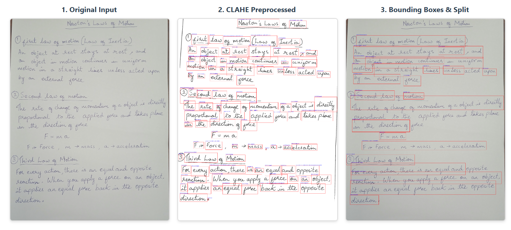

# Ankya-AI: Intelligent Character Recognition (ICR) & Grading Pipeline


An end-to-end intelligent grading solution with hybrid OCR and AI-driven semantic evaluation.

## Overview

Ankya-AI is an advanced Intelligent Character Recognition (ICR) and automated grading system designed to evaluate handwritten student answers. It leverages a multi-stage pipeline combining state-of-the-art OCR technologies, semantic analysis, and Large Language Models (LLMs) to provide accurate scores and detailed feedback.

The system features a **modern decoupled architecture**:
- **Teacher Dashboard (Frontend)**: A React/Vite-based UI for uploading documents, parsing answer keys, and reviewing auto-grades.
- **Grading Engine (Backend)**: A high-performance FastAPI server orchestrating the highly optimized AI pipeline capable of running on consumer hardware.

## Key Features

*   **Modern Decoupled Architecture**: Seamless integration between a React/Vite Teacher Dashboard and a FastAPI backend.
*   **Hybrid ICR Engine (ICR=Intelligent OCR)**: Combines **EasyOCR** for layout detection, **TrOCR** (Transformer OCR) for high-accuracy handwriting recognition, and **Tesseract** for fallback ensemble voting.
    *   **TrOCR Fine-tuning**: The system uses a custom `fine_tuned_trocr_small` model. It utilizes Parameter-Efficient Fine-Tuning (PEFT) via LoRA (Low-Rank Adaptation, `r=16`, `alpha=32`, targeting `query` and `value` modules). This approach achieves exceptionally high accuracy on domain-specific handwriting without the massive memory overhead of full model fine-tuning.
*   **Advanced Image Processing**: Automatically handles circled-digit normalization (e.g., matching ① to "1) ") and dynamic bounding box coalescing for multi-answer pages.
*   **Smart Memory Management**: Implements a `ModelManager` with lazy loading and aggressive automatic garbage collection to run heavy models (OCR, LLMs, Transformers) sequentially on limited GPU memory (e.g., 4GB VRAM).
*   **Multi-Dimensional Grading**:
    *   **Keyword Matching**: Fuzzy matching for essential terms.
    *   **Semantic Similarity**: Uses `SentenceTransformer` to measure meaning against reference answers via improved cosine-based scoring.
    *   **Grammar Analysis**: AI-based Seq2Seq grammar error correction scoring.
    *   **Content Coverage**: Verifies coverage of key reference points.
    *   **Presentation**: Heuristic scoring based on answer length and structure.
*   **Auto-Rubric Generation**: Automatically generates grading rubrics dynamically by parsing uploaded PDF Answer Keys and Question Papers using LLMs.

## Pipeline Architecture

The core logic resides in `pipelines/icr_pipeline3.py` and follows this step-by-step workflow:

1.  **Image Preprocessing**: Raw handwriting images are processed using CLAHE contrast boosting, deskewing, and morphological ruled-line removal to isolate the ink.
    <br>
    
    <br>
2.  **Layout Detection**: EasyOCR is used to detect bounding boxes on the *raw* images to preserve cursive stroke connectivity.
3.  **Text Extraction (ICR)**: The fine-tuned TrOCR model performs line-by-line character recognition on the preprocessed image crops.
4.  **Deterministic Scoring**: The extracted text is scored across keywords, semantics, grammar, and content coverage dimensions.
5.  **LLM Evaluation**: The extracted text and grading rubrics are sent to TinyLlama to generate a personalized, constructive feedback comment for the student.
6.  **Result Aggregation**: All scores and feedback are combined and returned as JSON data to the React frontend for teacher review.

## Installation

Ensure you have Python 3.9+ and Node.js installed.

### Backend Setup (FastAPI & AI Models)

```bash
# Create and activate a virtual environment
python -m venv venv
venv\Scripts\activate  # On Windows
# source venv/bin/activate  # On Linux/Mac

# Install dependencies
pip install -r requirements.txt
```
*Note: You may need to install `tesseract-ocr` separately on your system. PyTorch GPU version should be installed manually based on your CUDA version.*

### Frontend Setup (React/Vite)

```bash
# Navigate to the frontend directory
cd frontend

# Install dependencies
npm install
```

## Usage

Start both servers to access the full Ankya-AI system.

### 1. Start the Backend

```bash
# From the project root
python start_server.py
```
*The FastAPI server will start on `http://localhost:8000`.*

### 2. Start the Frontend Dashboard

```bash
# From the frontend directory
npm run dev
```
*The React dashboard will start on `http://localhost:5173`.*

Open your browser to the frontend URL. You can:
1. Upload a Questions PDF and Answer Key PDF to **Auto-Generate a Rubric** (via `/parse-qa-documents/`).
2. Upload a student's answer sheet image or PDF.
3. Review the AI-generated scores and feedback, and provide **manual overrides** if necessary (via `/grade-page/`).

## Configuration

The pipeline automatically detects if CUDA is available. You can adjust model paths and settings in the `Config / Globals` section of `icr_pipeline3.py`.

*   **Models Used**:
    *   OCR: Custom LoRA PEFT `fine_tuned_trocr_small`, `EasyOCR`
    *   Embeddings: `all-MiniLM-L6-v2`
    *   Grammar: `prithivida/grammar_error_correcter_v1`
    *   LLM: `TinyLlama/TinyLlama-1.1B-Chat-v1.0`

## License

[MIT License](LICENSE)
